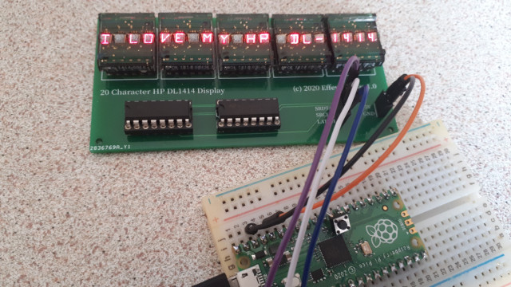

# HPDL1414-display
A 20 character display using HP DL1414 modules driven by 74HC595 shift registers

Includes :
1. PCB design for a 20 character display using 5 HP DL1414 modules and 2 74HC595 shift registers
2. Arduino code (parallel connection to µcontroller using 10 gpio pins)
3. MicroPython module and example code : 
    * parallel conncection to µcontroller using 10 gpio pins
    * serial connection to µcontroller using 3 gpio pins and 2 74HC595 shift registers (see picture above)
